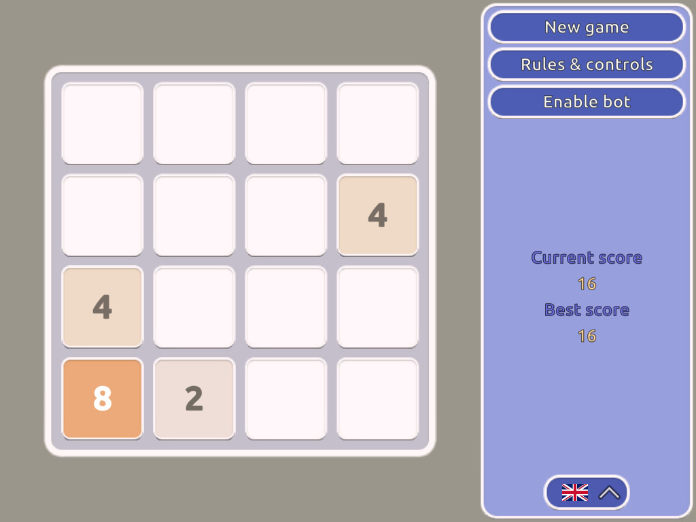

# Sample game 2048

Code sample - clone of "2048" game written in C#/Unity.



## Setup

1. Run setup script
```
python setup.py -u UNITY_EXE_PATH
```
2. Open the project in Unity
3. If a DOTween setup window appears, perform the setup according to the instructions in that window
4. Import TMP Essentials using the "Window -> TextMeshPro -> Import TMP Essential Resources" menu option
